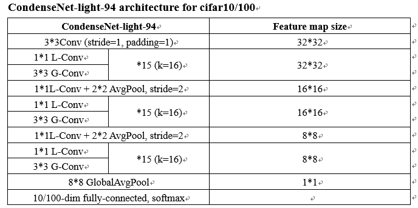
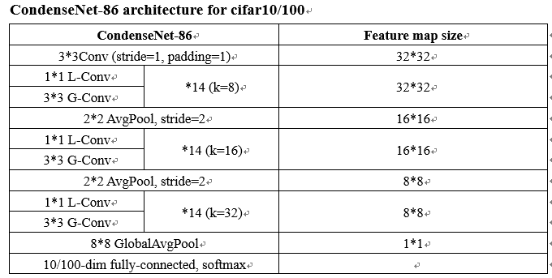

# CondenseNets

Ref Paper and official code:

[CondenseNet: An Efficient DenseNet using Learned Group Convolutions](https://arxiv.org/abs/1711.09224)

https://github.com/ShichenLiu/CondenseNet

We implemented CondenseNets using TensorFlow, including training and inference phase.

## Contents

1. [Introduction](#introduction)
2. [Usage](#usage)
3. [Results](#results)

### Introduction

___

**CondenseNet-94-light Network structure**



**CondenseNet-86 Network structure**



For other network structures and detailed informations, you can refer to the [paper](https://arxiv.org/abs/1711.09224)

### Usage

___

#### Dependencies

- [Python3](https://www.python.org/downloads/)
- [Tensorflow(1.6+)](http://tensorflow.org/)
- [CIFAR](https://www.cs.toronto.edu/~kriz/cifar.html)

#### File structure

1. [`hp_condensenet.py`](./hp_condensenet.py) Hyper parameters for CondenseNets
2. [`Condensenet.py`](./Condensenet.py) Training Condensenet
3. [`Condensenet_test.py`](./Condensenet_test.py) After Training Finished, evaluate from checkpoint directory, implement Learned group convolutions with standard group convolutions
4. [./datasets](./datasets/) contains [`cifar10.py`](./datasets/cifar10.py) and [`cifar100.py`](./datasets/cifar100.py)
5. [./utils](./utils) contains useful functions in [`utils.py`](./utils/utils_con.py)

#### Train

As en example, use the following step to train CondenseNet-94-light on cifar-100

* Firstly, open `hp_condensenet.py`, and make sure the hyper-parameters are correct, and set logs, checkpoint file directory

  and you can adjust other hyper-parameters in `hp_condensenet.py` for your training

  ```python
  growthRate = 16 # control each layer output channels
  layerPerBlock = 15 # how many layer in one block
  exp = 4 # control 1x1 bottleneck output channels
  igr = [1, 1, 1] # increasing growth rate parameters, if set [1, 2, 4], means exponentially growth
  
  # logs dir
  train_log_dir = './CondenseNet/logs/run1/'
  
  # ckpt model dir
  ckpt_dir = './CondenseNet/model/run1/'
  
  ```

* Then, run Condensenet.py using the following command

  ```
  python Condensenet.py
  ```

#### Evaluation

We take the CIFAR-100 model trained above as an example.

To evaluate the trained model using standard group convolution, use `python Condensenet_test.py` to evaluate from the default checkpoint directory

### Results

____

Results on CIFAR100

|            Model             | FLOPs | Params | Top-1 Acc. |
| :--------------------------: | :---: | :----: | :--------: |
| CondenseNet-94-light (C=G=4) | 137M  | 0.947M |   75.72    |
|    CondenseNet-86 (C=G=4)    |  76M  | 0.592M |   76.32    |

You can adjust network structure and hyper-parameters for your specific applications.