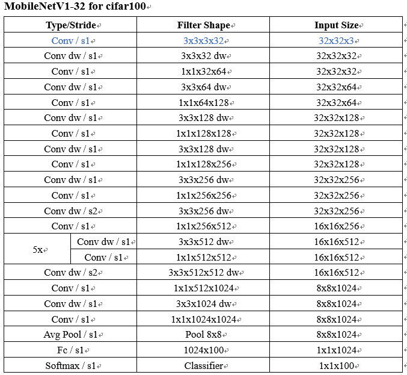
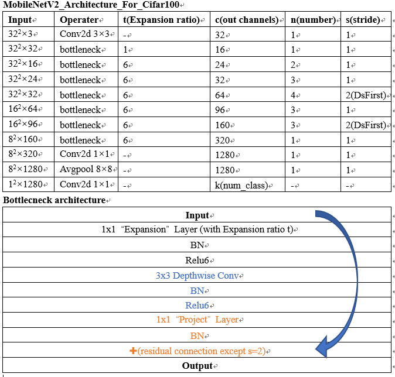

# MobileNets

original MobileNets and MobileNetV2 using Learned Group Convolution

Reference Paper:

[MobileNets: Efficient Convolutional Neural Networks for Mobile Vision Applications](https://arxiv.org/abs/1704.04861)

[MobileNetV2: Inverted Residuals and Linear Bottlenecks](https://arxiv.org/abs/1801.04381)

 

We implemented original MobileNets and MobileNetV2_GC/LGC using TensorFlow, all models are trained and tested on CIFAR-100 datasets

## Contents

1. [Introduction](#introduction)
2. [Usage](#usage)
3. [Results](#results)

### Introduction

___

Since the official did not experiment on CIFAR dataset, we modified the original network structure to get it.

* **MobileNetV1 Network structure for CIFAR-100**



* **MobileNetV2 Network structure for CIFAR-100**



* **MobileNetV2-LGC Network structure for CIFAR-100**

  Replace 1x1 Conv with 1x1 L-Conv (learned group convolution) on "Expansion" and "Projection" layers based on structure above.

For other network structures and detailed informations, you can refer to papers above.

### Usage

___

#### Dependencies

- [Python3](https://www.python.org/downloads/)
- [Tensorflow(1.6+)](http://tensorflow.org/)
- [CIFAR](https://www.cs.toronto.edu/~kriz/cifar.html)

#### File structure

1. [`hp_mobilenet.py`](./hp_mobilenet.py) Hyper parameters for MobileNets
2. [`mobilenetv1.py`](./mobilenetv1.py) Training MobileNetV1
3. [`mobilenetv2.py`](./mobilenetv2.py) Training MobileNetV2
4. [`mobilenetv2_lgc_gc.py`](./mobilenetv2_lgc_gc.py) Training MobileNetV2_LGC/GC
5. [`mobilenetv2_lgc_gc_test.py`](./mobilenetv2_lgc_gc_test.py) After Training Finished, evaluate from checkpoint directory, implement Learned group convolutions with standard group convolutions
6. [./datasets](./datasets/) contains [`cifar10.py`](./datasets/cifar10.py) and [`cifar100.py`](./datasets/cifar100.py)
7. [./utils](./utils) contains useful functions in [`utils.py`](./utils/utils_mob.py)

#### Train

As en example, use the following step to train MobileNet-LGC on cifar-100

- Firstly, open `hp_mobilenet.py`, and make sure the hyper-parameters are correct, and set logs, checkpoint file directory

  and you can adjust other hyper-parameters in `hp_mobilenet.py` for your training

  ```python
  # width multiple
  widthMultiple = 0.5
  
  # expansion ratio only for V2
  expansionRatio = 1
  
  # lgc / gc
  group = 4
  condense_factor = 4
  lasso_decay = 1e-5
  
  # logs dir
  train_log_dir = './MobileNet/logs/run1/'
  
  # check point model dir
  ckpt_dir = './MobileNet/model/run1/'
  ```

- Then, run `mobilenetv2_lgc_gc.py` using the following command

  ```
  python mobilenetv2_lgc_gc.py
  ```

#### Evaluation

We take the CIFAR-100 model trained above as an example.

To evaluate the trained model using standard group convolution, use `python mobilenetv2_lgc_gc_test.py` to evaluate from the default checkpoint directory

### Results

------

Results on CIFAR100

|                  Model                  | FLOPs(M) | Params(M) | Top-1 Acc.(%) |
| :-------------------------------------: | :------: | :-------: | :-----------: |
|           1.0 MobileNetV1-32            |   627    |    3.3    |     77.10     |
|           0.5 MobileNetV1-32            |   161    |   0.87    |     75.30     |
|           0.25 MobileNetV1-32           |   42.5   |   0.239   |     72.58     |
|               MobileNetV2               |   314    |   2.36    |     77.40     |
|             MobileNetV2 t=4             |   221    |   1.758   |     76.00     |
|             MobileNetV2 t=1             |    79    |   0.853   |     74.32     |
|             MobileNetV2-LGC             |   119    |   1.074   |     76.30     |
|       MobileNetV2-LGC Projection        |   215    |   1.638   |     77.20     |
| MobileNetV2-GC Expansion/LGC-Projection |   119    |   1.074   |     76.60     |

You can adjust network structure and hyper-parameters for your specific applications.

